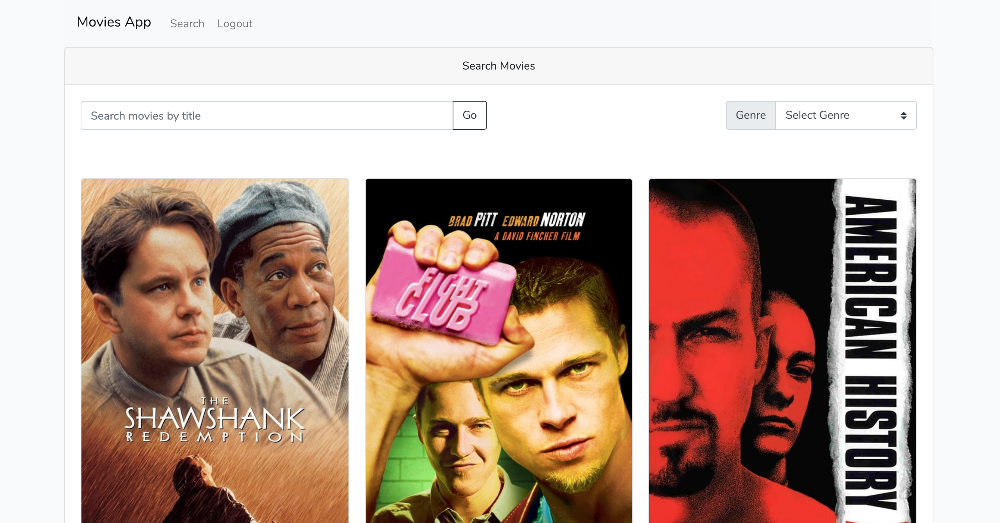

## Movies DB app

Laravel application that fetches data from TheMoviesDB API and displays results in Vue SPA.
- Simple JWT token authentication, user can register and login.
- Search by movie title or genre.
- Pagination 



### Installation

- You need to have PHP 7.2 installed on you machine, docker not working yet
- App is connected to free DB: [https://www.freemysqlhosting.net/](https://www.freemysqlhosting.net/)
- clone this repo and enter to it with terminal
- run ```composer install```
- run ```npm install```
- run ```npm run prod```
- PHP server:
    - run ```php artisan serve```
    - open your browser and go to ```http://127.0.0.1:8000```
    - you can register or login with credentials: ```roman@test.com``` : ```secret```


if you change .env file, make sure you run ```php artisan config:cache``` and ```npm run prod``` 

### Development

to work on front end app run ```npm run watch```

### TODO

Front End:
- decouple ./Pages/Search component
- sort out pagination when its showing 1000 pages.
- add logged user component, showing name and gravatar

Back End:
- fix docker DB connection issue

### Known Issues

If ```npm run watch``` gives vue-loader not installed error etc:

run ```npm i vue-template-compiler --save-dev```

https://github.com/vuejs/vue-loader/issues/560

---

if ```docker-compose up``` gives:

```ERROR: Service 'web' failed to build: Get https://registry-1.docker.io/v2/: net/http: request canceled while waiting for connection (Client.Timeout exceeded while awaiting headers)```

This is network / proxy issue. Try to use direct internet connection or try this: https://stackoverflow.com/questions/23111631/cannot-download-docker-images-behind-a-proxy

---
